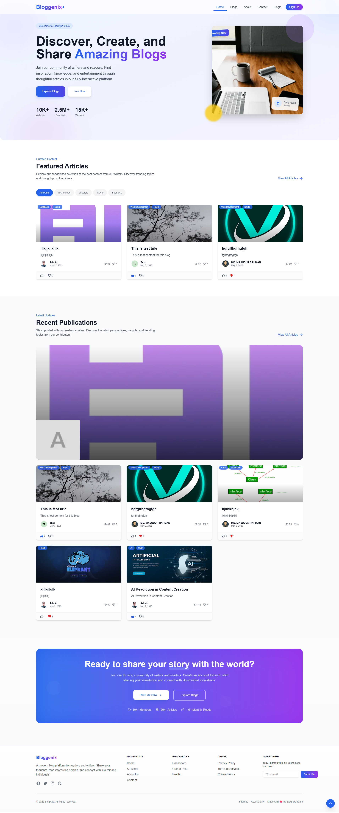

# 🚀 Bloggenix - Modern Blog Application

Bloggenix is a comprehensive blog application built with MERN stack (MongoDB, Express.js, React/Next.js, Node.js). It features rich content creation capabilities, user management, social interactions, and advanced administration tools.



## ✨ Features

### 👥 User Features

- **Authentication System** - Email/password login and OAuth integration (Google, Facebook)
- **User Dashboard** - Manage posts, view statistics, and update profile
- **Rich Content Creation** - Create blog posts with a feature-rich text editor
- **Social Interactions** - Comment, like/dislike, and share posts
- **Content Discovery** - Browse, search, and filter posts by categories and tags

### 👑 Admin Features

- **Comprehensive Dashboard** - Overview of site metrics and recent activity
- **Content Management** - Manage all posts, comments, and categories
- **User Management** - Add, edit, and manage user permissions
- **Analytics** - Detailed performance metrics with data visualization
- **Moderation Tools** - Approve/reject posts and comments

### ⚙️ Technical Features

- **Responsive Design** - Fully responsive UI that works on all devices
- **SEO Optimized** - Dynamic metadata, semantic markup, and proper page structures
- **Performance Optimized** - Fast loading times with optimized assets
- **Cross-Browser Compatible** - Works on all modern browsers
- **Error Handling** - Custom error pages and comprehensive error handling
- **Authentication & Security** - JWT, OAuth, password hashing, and secure storage

---

## 🏗️ Architecture

### Frontend

- **Framework**: Next.js 14+ with App Router
- **UI Library**: React 18+
- **Styling**: Tailwind CSS
- **Animations**: Framer Motion
- **State Management**: React Context API
- **Editor**: React Quill for rich text editing

### Backend

- **Runtime**: Node.js
- **Framework**: Express.js
- **Database**: MongoDB with Mongoose ODM
- **Authentication**: JWT, OAuth (Google, Facebook)
- **File Storage**: Cloudinary for images
- **Email Service**: Nodemailer for transactional emails

---

## 🚀 Getting Started

### Prerequisites

- Node.js (v14 or higher)
- MongoDB (local instance or MongoDB Atlas)
- Cloudinary account (for image uploads)
- Email service account (for verification emails)

### Installation and Setup

#### 1. Clone the Repository

```bash
git clone https://github.com/yourusername/bloggenix.git
cd bloggenix
```

#### 2. Backend Setup

```bash
# Navigate to backend directory
cd backend

# Install dependencies
npm install

# Create .env file (see Environment Variables section below)

# Start development server
npm run dev
```

#### 3. Frontend Setup

```bash
# Navigate to frontend directory
cd ../frontend

# Install dependencies
npm install

# Create .env.local file (see Environment Variables section below)

# Start development server
npm run dev
```

#### 4. Accessing the Application

- Frontend: http://localhost:3000
- Backend API: http://localhost:5000

### Environment Variables

#### Backend (.env)

```
PORT=5000
MONGODB_URI=mongodb://localhost:27017/bloggenix
JWT_SECRET=your_jwt_secret_key
FRONTEND_URL=http://localhost:3000

# Email configuration
EMAIL_SERVER_HOST=smtp.example.com
EMAIL_SERVER_PORT=587
EMAIL_SERVER_USER=your-email@example.com
EMAIL_SERVER_PASSWORD=your-email-password

# OAuth credentials
GOOGLE_CLIENT_ID=your_google_client_id
FACEBOOK_APP_ID=your_facebook_app_id

# Cloudinary config
CLOUDINARY_CLOUD_NAME=your_cloud_name
CLOUDINARY_API_KEY=your_api_key
CLOUDINARY_API_SECRET=your_api_secret
```

#### Frontend (.env.local)

```
NEXT_PUBLIC_API_URL=http://localhost:5000
NEXT_PUBLIC_GOOGLE_CLIENT_ID=your_google_client_id
NEXT_PUBLIC_FB_APP_ID=your_facebook_app_id
```

---

## 📋 Project Structure

### Frontend Structure

```
frontend/
├── app/                    # Next.js app router structure
│   ├── components/         # Shared React components
│   │   ├── home/           # Homepage-specific components
│   │   ├── layout/         # Layout components (navbar, footer)
│   │   └── shared/         # Reusable UI components
│   ├── context/            # React Context providers
│   ├── data/               # Mock data for development/fallback
│   ├── fonts/              # Custom font files
│   ├── utils/              # Utility functions
│   ├── about/              # About page
│   ├── admin/              # Admin dashboard and related pages
│   ├── blogs/              # Blog listing and detail pages
│   ├── contact/            # Contact page
│   ├── dashboard/          # User dashboard and related pages
│   ├── login/              # Authentication pages
│   └── ...
├── public/                 # Static assets
├── jsconfig.json           # JavaScript configuration
├── next.config.mjs         # Next.js configuration
└── tailwind.config.js      # Tailwind CSS configuration
```

### Backend Structure

```
backend/
├── config/                 # Configuration files
│   └── db.js               # Database connection
├── controllers/            # Route controllers
│   ├── authController.js   # Authentication logic
│   ├── postController.js   # Post management
│   └── ...
├── middleware/             # Express middleware
│   ├── auth.js             # Authentication middleware
│   └── ...
├── models/                 # Mongoose models
│   ├── User.js             # User model
│   ├── Post.js             # Post model
│   └── ...
├── routes/                 # API routes
│   ├── auth.js             # Authentication routes
│   ├── posts.js            # Post routes
│   └── ...
├── utils/                  # Utility functions
├── .env                    # Environment variables
└── server.js               # Main server file
```

---

## 📚 API Documentation

The API follows RESTful principles with the following main endpoints:

### Authentication

| Method | Endpoint                          | Description               | Access |
| ------ | --------------------------------- | ------------------------- | ------ |
| POST   | `/api/auth/register`              | Register new user         | Public |
| POST   | `/api/auth/login`                 | Login user                | Public |
| POST   | `/api/auth/oauth/google`          | Google OAuth login        | Public |
| POST   | `/api/auth/oauth/facebook`        | Facebook OAuth login      | Public |
| GET    | `/api/auth/verify-email/:token`   | Verify email with token   | Public |
| POST   | `/api/auth/forgot-password`       | Request password reset    | Public |
| POST   | `/api/auth/reset-password/:token` | Reset password with token | Public |

### User Management

| Method | Endpoint                            | Description              | Access  |
| ------ | ----------------------------------- | ------------------------ | ------- |
| GET    | `/api/users/profile`                | Get current user profile | Private |
| PUT    | `/api/users/profile`                | Update user profile      | Private |
| POST   | `/api/users/upload-profile-picture` | Upload profile picture   | Private |
| GET    | `/api/users`                        | Get all users            | Admin   |
| GET    | `/api/users/:id`                    | Get user by ID           | Admin   |

### Posts

| Method | Endpoint                   | Description              | Access  |
| ------ | -------------------------- | ------------------------ | ------- |
| GET    | `/api/posts`               | Get all posts            | Public  |
| GET    | `/api/posts/with-comments` | Get posts with comments  | Public  |
| GET    | `/api/posts/:id`           | Get post by ID           | Public  |
| GET    | `/api/posts/:id/similar`   | Get similar posts        | Public  |
| POST   | `/api/posts`               | Create new post          | Private |
| PUT    | `/api/posts/:id`           | Update post              | Private |
| DELETE | `/api/posts/:id`           | Delete post              | Private |
| PUT    | `/api/posts/:id/like`      | Like post                | Private |
| PUT    | `/api/posts/:id/dislike`   | Dislike post             | Private |
| GET    | `/api/posts/user/posts`    | Get current user's posts | Private |

### Comments

| Method | Endpoint                     | Description           | Access  |
| ------ | ---------------------------- | --------------------- | ------- |
| GET    | `/api/comments/post/:postId` | Get comments for post | Public  |
| POST   | `/api/comments`              | Create comment        | Private |
| PUT    | `/api/comments/:id`          | Update comment        | Private |
| DELETE | `/api/comments/:id`          | Delete comment        | Private |
| PUT    | `/api/comments/:id/like`     | Like comment          | Private |
| PUT    | `/api/comments/:id/dislike`  | Dislike comment       | Private |

### Categories

| Method | Endpoint                     | Description          | Access |
| ------ | ---------------------------- | -------------------- | ------ |
| GET    | `/api/categories`            | Get all categories   | Public |
| GET    | `/api/categories/:id`        | Get category by ID   | Public |
| GET    | `/api/categories/slug/:slug` | Get category by slug | Public |
| POST   | `/api/categories`            | Create category      | Admin  |
| PUT    | `/api/categories/:id`        | Update category      | Admin  |
| DELETE | `/api/categories/:id`        | Delete category      | Admin  |

### Admin

| Method | Endpoint                          | Description            | Access |
| ------ | --------------------------------- | ---------------------- | ------ |
| GET    | `/api/admin/dashboard`            | Get dashboard data     | Admin  |
| GET    | `/api/admin/users`                | Get all users          | Admin  |
| PUT    | `/api/admin/users/:id/activate`   | Activate user          | Admin  |
| PUT    | `/api/admin/users/:id/deactivate` | Deactivate user        | Admin  |
| PUT    | `/api/admin/users/:id/role`       | Update user role       | Admin  |
| GET    | `/api/admin/posts`                | Get all posts          | Admin  |
| PUT    | `/api/admin/posts/:id/status`     | Update post status     | Admin  |
| PUT    | `/api/admin/posts/:id/feature`    | Feature/unfeature post | Admin  |
| GET    | `/api/admin/comments`             | Get all comments       | Admin  |
| PUT    | `/api/admin/comments/:id`         | Update comment status  | Admin  |
| GET    | `/api/admin/analytics`            | Get site analytics     | Admin  |

For full API documentation, see [backend/README.md](./backend/README.md).

---

## 🧪 Testing

### Running Tests

```bash
# Frontend tests
cd frontend
npm test

# Backend tests
cd backend
npm test
```

---

## 🚀 Deployment

### Frontend Deployment

The frontend is configured for easy deployment on Vercel:

```bash
cd frontend
vercel
```

### Backend Deployment

The backend can be deployed to any Node.js hosting service like Heroku, Render, or Railway.

---

## 🌲 Development Workflow

### Branching Strategy

We follow the **Git Flow** branching model:

- `main` → **Production** (Stable code)
- `develop` → **Development** (Latest features)
- `username/pagename` → **UI pages** (For specific page work)
- `feature/{feature-name}` → **New features**
- `fix/{bug-name}` → **Bug fixes**
- `docs/{document-name}` → **Documentation**

Example:

```
masud/homepage
feature/user-authentication
fix/navbar-bug
docs/readme-update
```

### Commit Message Convention

We follow the **Conventional Commits** format:

```
<type>(scope): <subject>
```

Examples:

```bash
design(homePage): complete Home Page Design
feat(auth): add JWT authentication system
fix(ui): resolve navbar overlap issue on mobile
docs(readme): update installation steps
```

### Development Process

1. Pull latest changes: `git pull origin develop`
2. Create new branch: `git checkout -b feature/new-feature`
3. Make changes and follow coding standards
4. Write meaningful commit messages
5. Create a Pull Request to `develop`
6. Wait for code review and approval

---

## 📜 License

This project is licensed under the MIT License - see the [LICENSE](LICENSE) file for details.

---

## 👥 Contributors

- [Contributor Name](https://github.com/username)
- [Another Contributor](https://github.com/username)

---

## 📞 Support

For any issues or questions, please contact the project maintainers or open an issue on GitHub.

---

Happy Coding! 🚀✨
